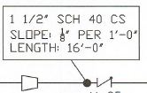
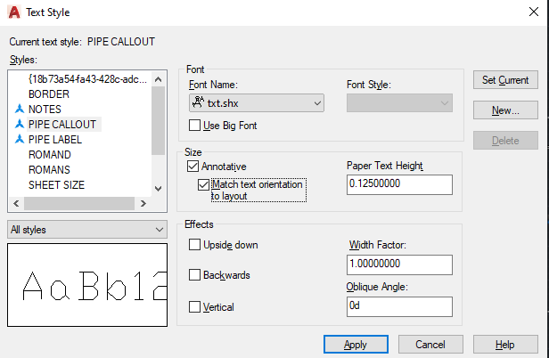

# 2020--4-30 Friday

- Working from home
- Total Hours: 26.48
- Clock-In: 8:45

- [ ] Drawings
    - [ ] SP-1018
    - [ ] SP-1022

# 2020-04-29 Wednesday

- Total Hours: 18.57
- Clock-In: 7:09

- [X] Sent SP-1030 for Approval
- [X] Updated Annex1
- [X] Made corrects to SP-1030

## Events to do or done

- [X] Sent SP-1030 for Approval
- [X] Updated Annex1
- [X] Backups
- [ ] Drawings
    - [ ] SP-1018
    - [ ] SP-1022

## Notes

- thinking about doing a workflow list
- start to document standards

# 2020-04-28 Tuesday

- Total Hours: 9.60
- Clock-In: 6:59

## Events to do or done

- [X] Backups
- [X] Documentation SAFETY 15
- [X] Started thank you card for mask

## Notes

*  Discussed call out for pipe line with Wren
    - diameter and material on the same line
    - slope on the next line (ex: SLOPE: 1/2" PER 1-0')
    - length on the next line (ex: LENGTH: 18'-0")
    - box around the information
    - filled circle to anchor a leader to the line
    - the leader pointing to the box
    - similar to first image 
    - call out text will be in the form of the second image
    - this can be accomplished by a multileader.
        - name the multileader: PIPE CALLOUT

